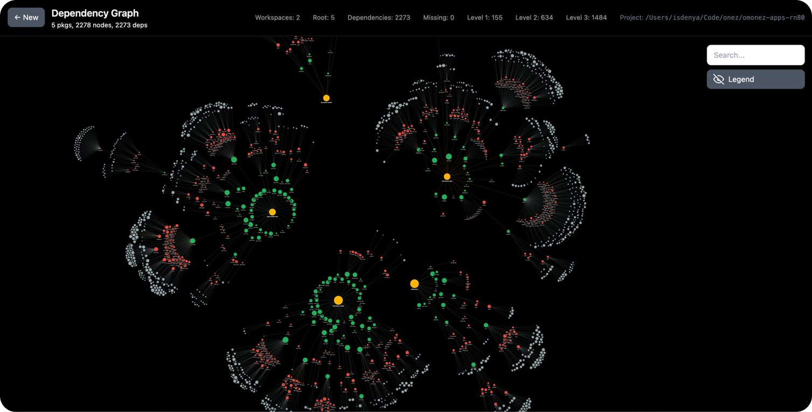
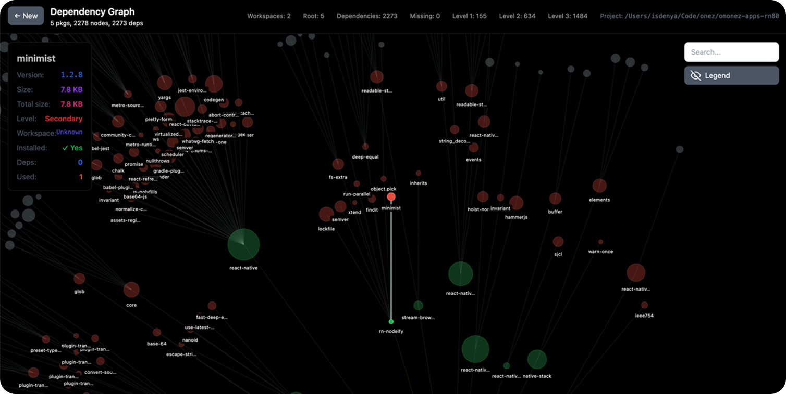

# DepeGraph

A powerful dependency graph analyzer for Node.js projects that visualizes your project's dependencies in an interactive, beautiful graph format.




## Features

- 🔍 **Interactive Visualization**: Explore your dependency tree with an intuitive D3.js-powered interface
- 🌟 **Sunburst Layout**: Dependencies radiate from root packages like rays of the sun
- 🏷️ **Smart Labeling**: Hover to expand truncated package names
- 🎯 **Connection Highlighting**: Click or hover on nodes to highlight all connected dependencies
- 🏢 **Workspace Support**: Multi-workspace projects are organized and color-coded
- 🔄 **Real-time Analysis**: Analyzes package.json, yarn.lock, and package-lock.json files
- 📱 **Responsive Design**: Works on desktop and mobile devices
- 🎨 **Beautiful UI**: Dark theme with smooth animations and modern design

## Installation

### Quick Start with npx (Recommended)

```bash
# Analyze current directory
npx depegraph

# Use custom port
npx depegraph --port 3000
```

### Global Installation

```bash
npm install -g depegraph
DepeGraph
```

## Usage

### Basic Usage

```bash
# Navigate to your Node.js project
cd my-awesome-project

# Run DepeGraph
npx depegraph

# Browser will automatically open at http://localhost:8831
```

### Advanced Usage

```bash
# Analyze a current project folder
npx depegraph

# Use a different port
npx depegraph --port 3000
```

### Command Line Options

```bash
depegraph [options]

Options:
  -p, --port <port>     Port number (default: 8831)
  -h, --help           Display help for command
```

## Supported Project Types

DepeGraph works with any Node.js project that uses:

- **npm** (package.json + package-lock.json)
- **Yarn** (package.json + yarn.lock)
- **pnpm** (package.json + pnpm-lock.yaml)
- **Monorepos** with workspaces
- **Lerna** projects
- **Rush** projects

## Graph Features

### Interactive Controls

- **Hover** over nodes to see connection highlights
- **Drag** nodes to reposition them
- **Zoom** and pan to explore large dependency trees
- **Click** on nodes to focus on their connections

### Visual Elements

- **🟢 Green Nodes**: Direct dependencies
- **🔵 Blue Nodes**: Root packages/workspaces
- **🟠 Orange Nodes**: Development dependencies
- **📏 Node Size**: Indicates dependency depth
- **🔗 Connection Lines**: Show dependency relationships

### Workspace Organization

In monorepo projects, DepeGraph automatically:
- Groups dependencies by workspace
- Places each workspace in its own cluster
- Shows cross-workspace dependencies
- Labels workspace boundaries

## Performance

DepeGraph is optimized for large projects:
- ✅ Handles 1000+ dependencies smoothly
- ✅ Efficient force-directed layout algorithms
- ✅ Smart label rendering (only visible labels are processed)
- ✅ Debounced hover effects
- ✅ Minimal memory footprint

## Development

### Prerequisites

- Node.js 18+
- npm, yarn, or pnpm

### Setup

```bash
# Clone the repository
git clone https://github.com/dsshard/depegraph.git
cd depegraph

# Install dependencies
npm install

# Start development server
npm run dev

# Build for production
npm run build
```

### Development Workflow

1. Fork the repository
2. Create a feature branch (`git checkout -b feature/amazing-feature`)
3. Commit your changes (`git commit -m 'Add amazing feature'`)
4. Push to the branch (`git push origin feature/amazing-feature`)
5. Open a Pull Request

## Troubleshooting

### Common Issues

**Port already in use:**
```bash
npx depegraph --port 3001
```

**Large projects loading slowly:**
- DepeGraph automatically optimizes for large projects
- Try filtering to specific workspaces if needed

**Browser doesn't open automatically:**
- Manually navigate to `http://localhost:8831`
- Check if your system supports the `open` command

**Dependencies not showing:**
- Ensure your project has `package.json`
- Run `npm install` or `yarn install` first
- Check that lock files are present

### Debug Mode

```bash
DEBUG=1 npx depegraph
```

## License

MIT © [Steven Green](https://github.com/dsshard/depegraph)

## Changelog

### v1.0.0
- 🎉 Initial release
- ✨ Interactive dependency visualization
- 🌟 Sunburst layout algorithm
- 🏢 Workspace support
- 📱 Responsive design

---

**Made with ❤️ for the Node.js community**

*If DepeGraph helped you understand your project better, please give it a ⭐ on GitHub!*